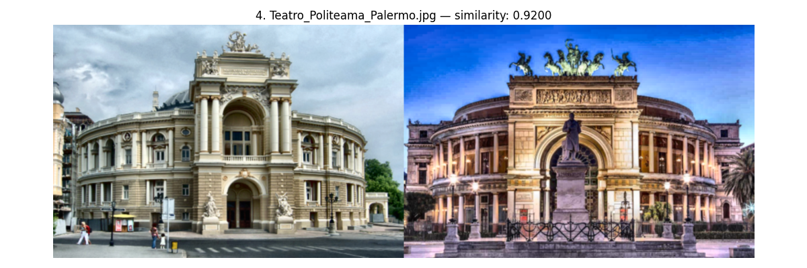

# 🎭 CNN-Based Visual Matching of Ukrainian and Global Theatres

This project presents a deep learning-based visual similarity system to compare the facades of iconic Ukrainian theatres — Kyiv, Odesa, and Lviv — against a curated dataset of 100 renowned theatres from around the world. The comparison leverages pretrained CNN architectures (ResNet50) and visual explainability methods (Grad-CAM) to evaluate and interpret similarity.

---

## 🔍 Goal

To build an interpretable, reproducible system for semantic and architectural comparison of theatre facades — with a focus on Ukrainian cultural landmarks. This can serve educational, archival, and urban studies purposes.

---

## 🧭 Business Value

This project delivers a practical and interpretable computer vision pipeline for architectural comparison, with specific focus on Ukrainian cultural landmarks. It demonstrates how neural networks can be used not only for object detection or classification, but also for structural and aesthetic analysis of real-world buildings.

🔹 **Cultural and Urban Heritage Applications**  
Compare Ukrainian theatres (Kyiv, Odesa, Lviv) with global architecture to explore stylistic lineage, design parallels, and visual heritage — useful for researchers, architects, and cultural analysts.

🔹 **Museum & Exhibition Enhancement**  
The top-matching theatre images can be integrated into interactive exhibits or online platforms, showing visitors how Ukrainian theatres relate visually to other iconic buildings across the world.

🔹 **AI-Powered Visual Search Tools**  
This project can be used as a prototype for systems enabling semantic-based image search in architectural archives, urban planning databases, or city tourism apps.

🔹 **Academic and Teaching Use**  
This script is valuable for demonstrating CNN-based interpretability using Grad-CAM — helping students understand what convolutional models focus on, and how global vs. local visual similarity is computed.

🔹 **Digital Documentation and Urban Monitoring**  
Automatically detect and group structurally similar facades in digital city scans (e.g. drone footage, city heritage databases), making it easier to audit or preserve regional aesthetics.

---
## 📍 Visualization Example


## 📂 Project Structure

```
📁 Ukrainian_Theatre_Comparison/
├── Ukraine/ # Contains 3 Ukrainian theatre images (Kyiv, Odesa, Lviv)
├── theatre_dataset/ # Global theatre dataset (100+ samples)
├── results/ # Output visualizations and logs for each Ukrainian theatre
│ ├── Kyiv/
│ │ ├── best/ # Top-5 most similar theatres
│ │ ├── opposite/ # Bottom-3 least similar theatres
│ │ ├── grad_cam/ # Grad-CAM heatmaps for visual explanation
│ │ └── console_output_kyiv.log
│ ├── Odesa/
│ │ ├── best/
│ │ ├── opposite/
│ │ ├── grad_cam/
│ │ └── console_output_odesa.log
│ └── Lviv/
│ ├── best/
│ ├── opposite/
│ ├── grad_cam/
│ └── console_output_lviv.log
├── image_resolution_report.txt # Log file of image sizes
├── cnn_based_theatre_similarity.py # Complete processing pipeline (the script in this repo)
└── README.md
```

---

## 🧠 Technologies Used

- **CNN Backbone**: Pretrained ResNet50 (2048-dim descriptors)
- **Similarity Metric**: Cosine similarity for global feature matching
- **Explainability**: Grad-CAM heatmaps for attention analysis
- **Image Processing**: OpenCV (resize, CLAHE, GaussianBlur)
- **Visualization**: Matplotlib, TorchCam

---

## 📸 Dataset: World Theatre Facades

The global reference dataset contains 100 theatre facade images from across Europe, Asia, and the Americas.

📥 **Download**: [Google Drive Link](https://drive.google.com/file/d/1k_-wl9tCBCMC-9uTtBvPeM0fMfbfJfSS/view?usp=drive_link)

The dataset was manually collected and curated to ensure frontal views and standardized dimensions.

---

## 🧪 How It Works

1. **Image Resolution Validation**: Checks and logs all input dimensions to ensure consistent preprocessing.
2. **Preprocessing**: Resizes images to 600×400, enhances contrast with CLAHE, applies Gaussian blur.
3. **Feature Extraction**: Extracts global descriptors using ResNet50 (without classification head).
4. **Similarity Matching**: Compares Ukrainian theatre image against global dataset via cosine similarity.
5. **Visualization**: Displays side-by-side comparisons and Grad-CAM overlays for similar matches.

---

## 📈 Sample Results

- Lviv and Odesa theatres yielded **highly meaningful visual matches**, often with Baroque or Neoclassical counterparts.
- The Kyiv Opera, while recognizable, showed **weaker alignment** due to frontal view issues and architectural occlusion.
- Grad-CAM maps helped identify which regions influenced the model's attention during comparison.

---

## 🛠️ Future Improvements

- **CLIP ViT Integration**: Add CLIP-based semantic embeddings for richer comparisons.
- **Auto Save**: Store `top_matches.csv` and heatmaps for batch processing or review.
- **Extended Dataset**: Improve both the **size** and **quality** of global theatre facades.
- **Database Parsing**: Replace manual collection with parsing from public architecture or tourism APIs.
- **Theatre Flexibility**: Allow matching from **any Ukrainian theatre**, not just the Kyiv/Odesa/Lviv trio.
- **Heatmap Analytics**: Quantify CAM similarity (e.g. overlap %, pixel diff) for research-grade insights.

---

## 📘 Grad-CAM Interpretation Notes

- Grad-CAM shows **attention maps**, not pixel-level similarity.
- Use it to understand **what regions were most influential**, not for exact matching.
- Cosine similarity operates **globally** on the entire image descriptor, even if not all regions are visually highlighted.
- Matching CAM hotspots suggests **shared architectural focus**, but absence doesn’t imply dissimilarity.

---

## 📬 Contact

Feel free to reach out or fork the project for adaptation to your own city or business sector.

© 2025 Ivan Tatarchuk (Telegram - @Ivan_Tatarchuk; LinkedIn - https://www.linkedin.com/in/ivan-tatarchuk/)
