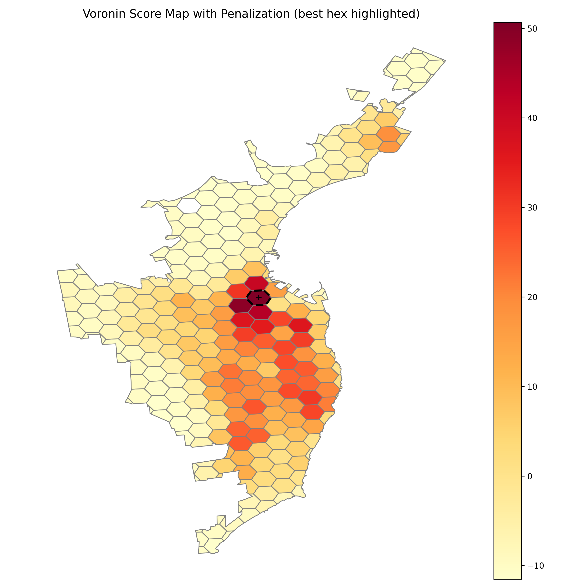

# 🧭 Odesa Fast Food Business Location Analysis

**Author:** Ivan Tatarchuk  
**Goal:** Identify optimal locations in Odesa, Ukraine, for opening fast food venues using geospatial data and multi-criteria decision modeling.

---

## 🔍 Project Summary

This project combines urban data, population density, and categorized Points of Interest (POIs) to help businesses and investors make data-driven decisions on where to open fast food outlets. It integrates:

Food establishment data from OpenStreetMap, including fast food venues, restaurants, cafes, bars, and canteens

General POIs grouped into meaningful business categories such as universities, offices, malls, transport hubs, entertainment, markets, and tourism spots

Population density data from the Kontur H3 hexagon dataset, representing actual residential load across the city

H3 hexagonal grid aggregation for spatial alignment and comparability across the urban area

Extended feature engineering that includes not only local values per hexagon but also aggregated metrics from neighboring hexagons

A multi-criteria Voronin scoring model that uses weighted, penalty-aware logic centered around real mean values to rank locations

---

## 📍 GIS Visualization Example.


---

## 🧱 Project Structure

```
├── Odesa_fastfood.py                      # Full project pipeline script
├── kontur_population_UA_20231101.gpkg     # Kontur H3 hexagons with population
├── minmax and weights for voronin.xlsx    # Weighting scheme for multicriteria model
├── filtered_food_odesa.csv                # Cleaned food-related points
├── Points_of_Interest_locations_Odesa.csv # Raw POIs before expansion
├── Expanded_POI_locations_Odesa.csv       # Categorized and expanded POI data
├── hex_voronin_matrix.csv                 # Base matrix per hexagon
├── hex_voronin_matrix_with_neigh.csv      # Matrix with neighbor aggregation
├── hex_voronin_scored.csv                 # Final scored hexagons (multicriteria model)
├── map_voronin_score.png                  # Heatmap of scores with best hex
├── console_output.log                     # Full output from script execution
├── Summary.png                            # Short description (slide) of project
├── requirements.txt                       # Tech stack for project
├── READMY.md                              # Full description of project
├── folder Visualizations                  # List of output graphics
```
---
External Data Requirement
This project uses high-resolution population data from the Kontur Population dataset, which cannot be uploaded to GitHub due to file size limits.

To run the project, please download the following file manually:

Visit: https://data.humdata.org/dataset/kontur-population-ukraine

Scroll to the "Resources" section and find the release:

📅 Release Date: 2023-11-01

📂 File Name: kontur_population_ua_20231101.gpkg (inside ZIP)

Download and unzip the archive

Place the .gpkg file inside the root project folder — next to your Odesa_fastfood.py

⚠️ The script will automatically read the file from the working directory. Make sure the filename matches exactly.
---

---

## ⚙️ How It Works (Pipeline Overview)

### 1. Load and Visualize City Data
- Load Odesa boundary and districts via OSMnx
- Visualize administrative regions and POIs

### 2. Extract and Clean Food & POI points
- Filter food-related amenities from OpenStreetMap
- Expand general POIs into 8 key business categories

### 3. Spatial Data Aggregation
- Overlay data onto H3 hexagons (resolution 9)
- Count food venues and POIs per hexagon
- Aggregate neighbor hex data to add context

### 4. Voronin Decision Model
- Apply weighted multi-criteria scoring
- Penalize below-average values (mean-centered logic)
- Rank all hexagons and visualize Top-5

### 5. Output
- CSVs with scoring and matrix
- Final PNG map with best-scoring area
- Logged console output for reproducibility

---

## 📊 Features Used

| Category               | Feature Names in Model                   |
|------------------------|-------------------------------------------|
| Demographics           | `population`, `population_neigh`         |
| Food supply            | `count_fastfood`, `count_restaurant`, `count_cafe`, `count_bar_pub`, and their neighbors |
| Demand generators      | `count_university`, `count_office`, `count_market`, `count_mall`, etc. and neighbors |
| Accessibility & traffic| `count_transport`, `count_tourism`, `count_entertainment`, etc. |

---

## 📤 Output Highlights

- ✅ `hex_voronin_scored.csv` – Final scored grid with business recommendations  
- 🗺️ `map_voronin_score.png` – Heatmap of scoring with best hexagon highlighted  
- 🏆 **Top 5 best locations identified**, with detailed score breakdown  
- 📊 See `console_output.log` for metric contributions and logs

---

## 🧠 Key Technologies

- Python 3.8
- [`geopandas`]
- [`osmnx`]
- [`shapely`, `h3`, `matplotlib`, `seaborn`]
- [`pandas`, `numpy`]
- OpenStreetMap & Kontur public datasets

---

## 💼 Business Value

This geospatial model helps fast food chains and urban planners:

- **Avoid high-competition zones**
- **Prioritize high-footfall areas**
- **Adapt strategy to POI density and neighborhood context**
- **Make robust, data-driven placement decisions**

The scoring framework is flexible and scalable to other cities or business types.

---

## 🧪 How to Run

```bash
pip install -r requirements.txt
python Odesa_fastfood.py
```

> 🔹 Console output and top results will be saved to `console_output.log`  
> 🔹 All intermediate CSVs will be created automatically

---

## 📌 Future Improvements

- Add interactive GUI or web-based map (e.g., using folium) for exploring scoring results and selecting candidate locations.

- Integrate real-time mobility, traffic flow, or retail spending data to enhance the accuracy of demand modeling.

- Expand model inputs with additional business-relevant variables.

- Extend the scoring engine into a full CRM-like analytical module with user demand forecasting and investor dashboards.

- Enable batch simulation of “what-if” scenarios.

---

## 📬 Contact

Feel free to reach out or fork the project for adaptation to your own city or business sector.

**© 2025 Ivan Tatarchuk (Telegram - @Ivan_Tatarchuk; LinkedIn - https://www.linkedin.com/in/ivan-tatarchuk/)**
