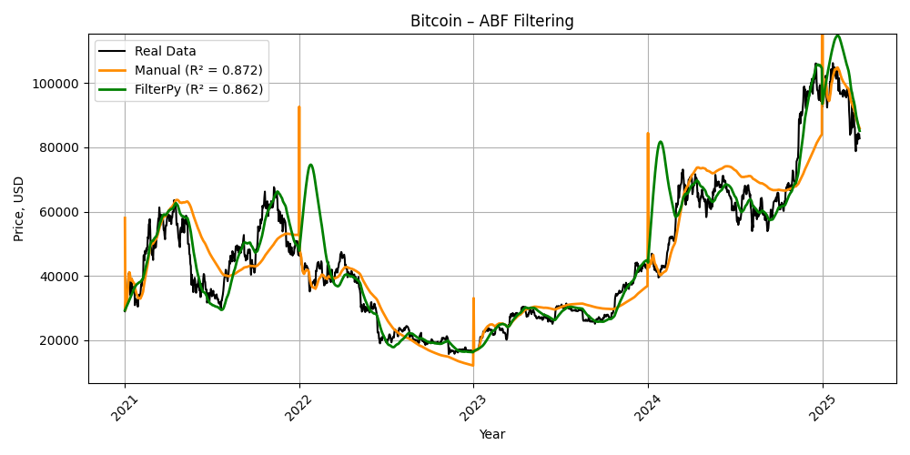

# 📉 Kalman-Based Filtering of Cryptocurrency Trends (Bitcoin, Ethereum, Solana)

> This project demonstrates the implementation of alpha-beta (ABF) and alpha-beta-gamma (ABGF) Kalman filtering techniques on real-world cryptocurrency time series, using both manual methods and the `FilterPy` library.

---

## 📁 Data Description

- **Source:** [CoinGecko Historical Data](https://www.coingecko.com/)
- **Assets Analyzed:**
  - Bitcoin (BTC)
  - Ethereum (ETH)
  - Solana (SOL)
- **Period Covered:** From **2021-01-01** to present
- **Format:** Raw `.xls` files containing `snapped_at` (timestamp) and `price`

---

## 🧭 Business Value

- **Financial Signal Processing:** Smoothed price signals can be used in downstream modeling.
- **Trend Detection:** Helps identify local trend changes and filter out market noise.
- **Model Validation:** Compares filter accuracy for future integration into real-time forecasting.
- **Educational Use:** Demonstrates the inner logic of recursive filters in Python.

---
## Visualization Example

## 🧠 Techniques Implemented

### ✅ Filtering Modes
- **ABF:** Alpha-Beta Filtering (Position & Velocity)
- **ABGF:** Alpha-Beta-Gamma Filtering (Position, Velocity & Acceleration)

### ✅ Implementations
1. **Manual implementation** — written from scratch for interpretability
2. **FilterPy-based implementation** — leveraging the `filterpy.kalman` module

---

## 🧮 Smoothing Logic

To avoid overfitting and increase robustness, the Kalman filters were applied in **chunk-based fashion**:
- **ABF:** filter reset every **365 days**
- **ABGF:** filter reset every **100 days**

This allowed filtering to better capture local patterns and avoid sticking too closely to recent noise.

---

## 📊 Evaluation Metrics
For each currency and filtering method, the following metrics were computed:

- **R² Score**
- **MAE (Mean Absolute Error)**
- **RMSE (Root Mean Squared Error)**

| Cryptocurrency | Method     | R²     | MAE        | RMSE      |
|----------------|------------|--------|------------|-----------|
| Bitcoin        | Manual     | 0.8720 | 5314.25    | 7741.07   |
| Bitcoin        | FilterPy   | 0.8619 | 4503.77    | 8040.53   |
| Ethereum       | Manual     | 0.7596 | 315.06     | 424.29    |
| Ethereum       | FilterPy   | 0.7139 | 277.19     | 462.86    |
| Solana         | Manual     | 0.8656 | 16.76      | 25.63     |
| Solana         | FilterPy   | 0.6733 | 18.75      | 39.96     |

---

## 🔍 Observations & Insights

- **Manual ABF** with chunked filtering showed best overall stability and interpretability.
- **ABGF** was more sensitive and sometimes unstable, particularly for volatile assets.
- **FilterPy** can be effective when initialized and tuned carefully.
- Chunked filtering is critical to avoid overfitting over long time horizons.
- Best R² values were observed on BTC, worst on ETH due to volatility.

---

## 🚀 Future Improvements

- Add **real-time update loop** for live crypto data
- Extend to other time series filters
- Compare with **ARIMA**, **LSTM** etc.
- Build an interactive **dashboard** for crypto price analysis

---

## 🛠️ Tech Stack

- Python 3.10
- NumPy, Pandas, Matplotlib
- scikit-learn, FilterPy
- Excel / CSV input processing

---

## 📬 Contact

Feel free to reach out or fork the project for adaptation to your own city or business sector.

© 2025 Ivan Tatarchuk (Telegram - @Ivan_Tatarchuk; LinkedIn - https://www.linkedin.com/in/ivan-tatarchuk/)
