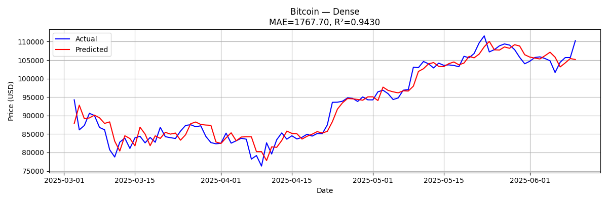

# 📉 Neural Network for Cryptocurrency Price Forecasting

## 🔍 Overview

This project demonstrates how neural networks (Dense and LSTM) can be used to forecast cryptocurrency prices using historical time series data.\
The main objective is to predict real future prices based on structured preprocessing, model training, and hyperparameter optimization.

The project is organized into three operational modes:

1. Mode 1: Synthetic training using artificially generated noisy data + live animation of predictions.
2. Mode 2: Real-time forecasting based on actual crypto prices from 2021–2025.
3. Mode 3: Grid-based hyperparameter optimization for both Dense and LSTM models.

---

## 📀 Data Source

Cryptocurrency data was collected from [CoinGecko](https://www.coingecko.com/en) and includes:

- Bitcoin (BTC)
- Ethereum (ETH)
- Solana (SOL)

Data spans from **early 2021 to mid-2025** and is provided in an Excel file (`prices.xlsx`) in long format (Coin, Date, Price).

---
## 📍 Forecasting Visualization Example


## 🧠 Technologies Used

| Component       | Library                         |
| --------------- | ------------------------------- |
| Neural Networks | TensorFlow 2.13.0, Keras 2.13.1 |
| Data Handling   | Pandas 2.0.3, NumPy 1.24.3      |
| Visualization   | Matplotlib 3.7.5                |
| Scaling         | scikit-learn 1.3.2              |
| Excel Parsing   | openpyxl 3.1.5, xlrd 2.0.1      |

---

## ⚙️ Code Structure

### `load_and_prepare_crypto_prices(...)`

Parses long-format Excel into a wide-format time series with columns:

```
[Date, BTC_Price, ETH_Price, SOL_Price]
```

### `plot_crypto_prices(...)`

Displays price trends with half-year granularity (H1/H2 per year) across all 3 coins.

---

### Mode 1 — `train_model_with_animation(...)`

- Generates synthetic noise-based tensor data for neural network training.
- Trains a `Dense` model in live mode with real-time visualization of prediction convergence.

This allows observing how the model adapts even with distorted or noisy input, showing learning behavior.

---

### Mode 2 — `run_real_forecast(...)`

- Uses actual price history to train/test forecasting models.
- Supports two architectures:
  - `Dense` custom model with multiple hidden layers.
  - `LSTM` (Keras Sequential API).
- Forecasts are made for BTC, ETH, and SOL on the test set (Feb–Jun 2025).
- Model weights are loaded from best configurations previously saved in `.h5` files.

---

### Mode 3 — `optimize_dense_model(...)` & `optimize_lstm_model(...)`

Performs full grid search over architectural and training hyperparameters for each model:

- Dense search includes:

  - Layer architectures: `[64, 32]`, `[128, 64, 32]`, etc.
  - Activation: `relu`, `tanh`, `elu`
  - Optimizers: `Adam`, `Nadam`
  - Dropout rates: `0.0`, `0.1`

- LSTM search includes:

  - Units: `32`, `64`, `128`
  - Optimizers and learning rates
  - Batch sizes

The best model is saved to `best_dense_weights.h5` or `best_lstm_weights.h5` and used in Mode 2.

---

## 📊 Results Summary

| Model            | MAE (USD) | R² Score | Notes                       |
| ---------------  | --------- | -------- | --------------------------- |
| Bitcoin (Dense)  | ≈ 1768    | 0.943    | Best configuration          |
| Bitcoin (LSTM)   | ≈ 1968    | 0.923    | Slightly lower              |
| Ethereum (Dense) | ≈ 71      | 0.921    | Stable without optimization |
| Solana (Dense)   | ≈ 5.3     | 0.850    | General trend captured      |

---

## ✅ Key Takeaways

- Dense model outperformed LSTM due to shorter memory dependencies and faster convergence.
- Training & test data were strictly separated by date to prevent leakage.
- Inverse-scaling of outputs** was properly applied before calculating `MAE` and `R²` on raw prices.
- Custom class showcases manual architecture construction (with initializer, dropout, etc.).
- Code can be easily extended to other coins by updating the input Excel file.

---

## 📦 Skills Demonstrated

- Time Series Forecasting
- Neural Network Design (Dense, LSTM)
- Feature Engineering (Sliding Window)
- Grid Search for Hyperparameters
- Data Normalization & Scaling
- Custom TensorFlow Model Subclassing
- Model Evaluation using MAE & R²
- Animated Training Visualizations

---

## 📌 Files

- `NeuralNetwork_crypto.py`: Main Python script with all logic
- `prices.xlsx`: Input file with historical crypto data
- `best_dense_weights.h5`: Saved weights after Dense model optimization
- `best_lstm_weights.h5`: Saved weights after LSTM optimization
-  folder visualizations_and_logs: List of output graphics and logs
-  READMY.md: Full description of project
---

## 💼 Business Value

- Actionable Forecasts: Businesses and investors can utilize model outputs to anticipate market shifts and make informed trading decisions.
- Model Comparison: Enables evaluation of different model types (Dense vs. LSTM) on volatile assets.
- Adaptability: Modular structure allows easy re-training or extension to new cryptocurrencies.
- Educational Utility: Offers a clean and interactive way to understand how different neural architectures behave on time series data.

---

## 🔮 Future Improvements

- Longer Horizon Forecasting: Extend the prediction window.
- Multivariate Models: Integrate external factors like trading volume, social media sentiment, or macro indicators.
- Advanced Architectures: Experiment with GRU, Transformer, or hybrid CNN-LSTM models.
- API Integration: Deploy models in real-time dashboards or connect with exchanges for live predictions.

---

## 📬 Contact

Feel free to reach out or fork the project for adaptation to your own city or business sector.

© 2025 Ivan Tatarchuk (Telegram - @Ivan_Tatarchuk; LinkedIn - https://www.linkedin.com/in/ivan-tatarchuk/)
