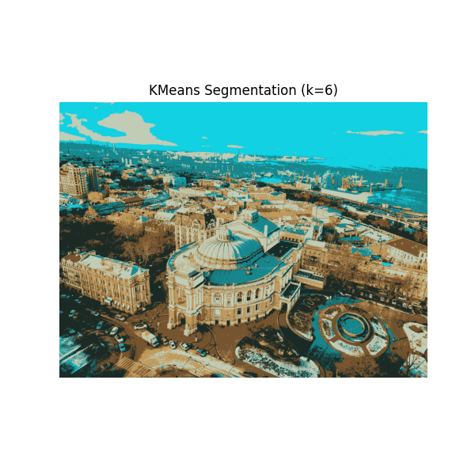
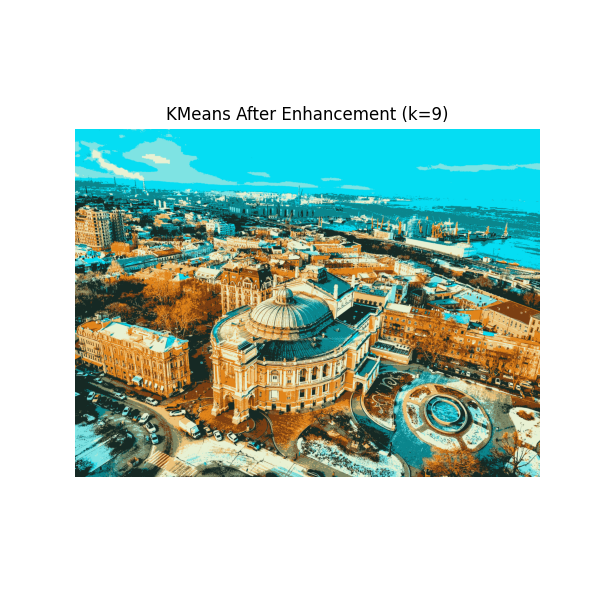

# 🏙️ Urban Image Segmentation — Odesa

**Category:** Computer Vision / Clustering / Urban Analytics  
**Author:** Ivan Tatarchuk  
**Image Source:** Street-level aerial photo of Odesa city center (Opera Theatre and Port)

---
## 📌 Project Overview

This project applies unsupervised image segmentation to a real-world urban photo of Odesa (Ukraine) using machine learning and computer vision tools.

We explore:
- How clustering with different `k` values impacts the quality of scene segmentation
- Whether pre-processing improves object isolation
- What types of real-world forms can be detected using shape and edge analysis

---
## 💼 Business Use Case

This R&D prototype demonstrates how low-cost computer vision techniques can be used for:
- Semantic segmentation of satellite or drone imagery
- Architectural pattern recognition and visual tagging
- Smart city insights (e.g., parks, roads, buildings, water zones)
- Infrastructure change detection or automated photo annotation

---
## 📍 Kmeans Visualizations

<p align="center">
  
  
</p>

---
## 🎯 Objectives

- Apply **KMeans clustering** to extract visual regions by color
- Test various values of `k` to find optimal segmentation granularity
- Enhance image clarity with **CLAHE + HSV boosting**
- Use **Canny edge detection** and **vector contouring** to identify shapes and objects
- Analyze visual layers of a real urban environment with minimal supervision

---
## 🧪 Technologies Used

- Python 3.11
- OpenCV (`cv2`)
- Scikit-Learn (`KMeans`)
- Pillow (`PIL`)
- NumPy, Matplotlib

---
## 🔁 Project Pipeline

```
Original Image →
⤷ KMeans Segmentation (k = 6, 9)
⤷ CLAHE + HSV Enhancement
⤷ Re-segmentation on Enhanced Image
⤷ Canny Edge Detection
⤷ Vector Contour Mapping
```

---
## 🧩 Clustering Analysis: Choosing k

We tested multiple values of `k` in KMeans to explore how segmentation changes:

| k Value | Observation |
|--------|-------------|
| 2 | Too coarse – just light vs dark zones |
| 3 | Sea and sky start to separate from buildings |
| 4 | Soil and trees are separated, but too similar in autumn tones |
| 5 | Sea and sky clearly split |
| 6 | Clouds isolated from sky – **optimal visual balance** |
| 7–10 | Over-segmentation starts; visual clarity drops |

✅ **Conclusion:** `k = 6` provided the best balance for original segmentation.  
After enhancement, `k = 9` offered better isolation of difficult elements (e.g., oil tankers near the port).

---
## 📊 Key Insights

- Color clustering with `k=6` is suitable for mid-complexity urban scenes
- Visual enhancement (CLAHE + HSV) significantly improves object distinction
- Geometric segmentation allows detection of:
  - Opera building
  - Sea vs land boundaries
  - Cars, park zones
  - Circular fountain

This combination allows scalable analysis of public imagery even without training datasets.

---
## 🚀 How to Run

1. Place your input image in the project directory as `Odesa_image.jpg`
2. Install dependencies:
   ```bash
   pip install numpy pillow matplotlib scikit-learn opencv-python
   ```
3. Run the script:
   ```bash
   python urban_image_segmentation_odesa.py
   ```

---
## 🔮 Future Improvements

- Add YOLO or semantic segmentation for object classification
- Automate k-value optimization using silhouette or inertia analysis
- Extend to batch processing of satellite/aerial images
- Integrate with GIS pipelines for georeferenced outputs

---
## 📬 Contact

Feel free to reach out or fork the project for adaptation to your own city or business sector.

© 2025 Ivan Tatarchuk (Telegram - @Ivan_Tatarchuk; LinkedIn - https://www.linkedin.com/in/ivan-tatarchuk/)
